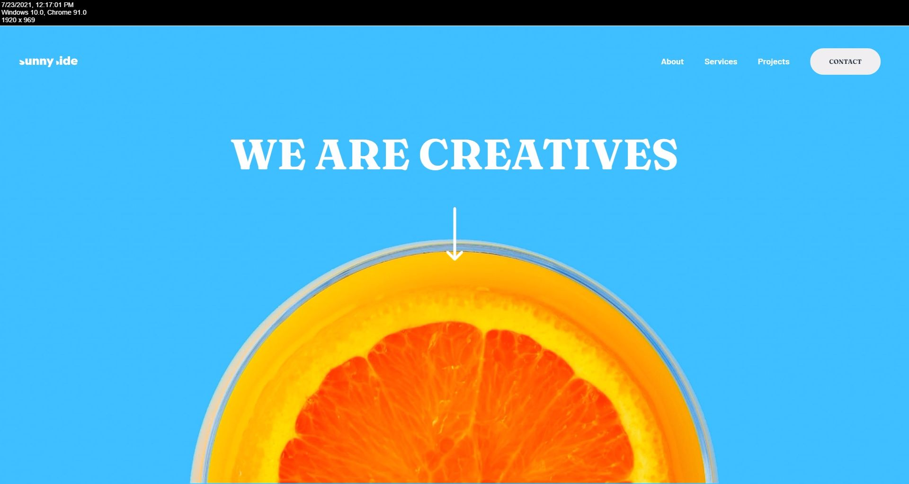

# Frontend Mentor - Sunnyside agency landing page solution

This is a solution to the [Sunnyside agency landing page challenge on Frontend Mentor](https://www.frontendmentor.io/challenges/sunnyside-agency-landing-page-7yVs3B6ef). Frontend Mentor challenges help you improve your coding skills by building realistic projects.

## Table of contents

- [Overview](#overview)
  - [The challenge](#the-challenge)
  - [Screenshot](#screenshot)
  - [Links](#links)
- [My process](#my-process)
  - [Built with](#built-with)
  - [What I learned](#what-i-learned)
  - [Continued development](#continued-development)
- [Author](#author)

## Overview

### The challenge

Users should be able to:

- View the optimal layout for the site depending on their device's screen size
- See hover states for all interactive elements on the page

### Screenshot

### Links

- Solution URL: [https://github.com/CommanderMeow/Sunnyside-agency-landing](https://github.com/CommanderMeow/Sunnyside-agency-landing)
- Live Site URL: [https://commandermeow.github.io/Sunnyside-agency-landing/](https://commandermeow.github.io/Sunnyside-agency-landing/)

## My process

### Built with

- Semantic HTML5 markup
- SCSS
- Flexbox
- CSS Grid
- JS

### What I learned

CSS Grid has always been a bit confusing so I tackled it with this projects. It took several frustrating attemptings to remedy issues I was having but I am proud of the fact I was able to overcome certain obsticles and understand CSS grid better.

### Continued development

I will continue to use more CSS Grid in the future and find better and more effective ways of implimenting it with flex box instead of only ever going with flex.

## Author

- Frontend Mentor - [@CommanderMeow](https://www.frontendmentor.io/profile/CommanderMeow)

